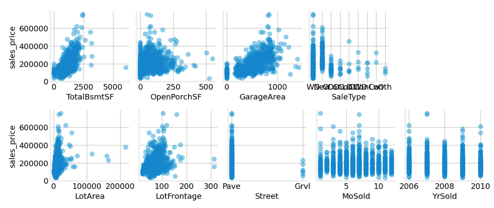
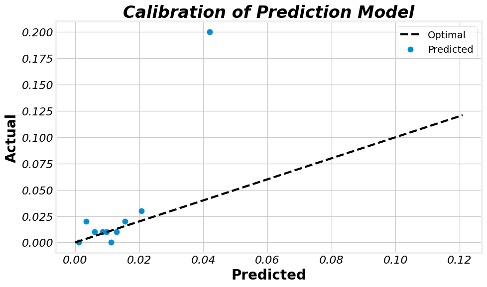

# DS-Helpers

This is a library that contains some helper functions and classes to make it easier to visualize data and build machine learning pipelines.


## Local Installation

You can install the library locally with the following command:

`pip install git+https://github.com/ramalldf/ds-helpers.git`

Then verify that ds-helpers was installed with `pip freeze` 

## Examples
```Python
# Load auxilary libraries for example
import pandas as pd
from sklearn.datasets import fetch_openml
from sklearn.model_selection import train_test_split

# Load and extract sample data
raw = fetch_openml(data_id=42165, as_frame=True)

```

### Plot Features Against Target
```Python
from ds_helpers.dataviz_helpers import plot_pairs, load_mpl_style

# Apply custom style
load_mpl_style()

# Assemble data
data = pd.DataFrame(raw['data'], columns=raw['feature_names'])
data['sales_price'] = raw['target']

# Keep a subset of columns to plot
my_feats = ['LotArea', 'LotFrontage', 'Street', 'MoSold', 'YrSold', 'TotalBsmtSF', 'OpenPorchSF', 'GarageArea', 'SaleType', 'sales_price']
clean = data[my_feats]

# Plot pairs
grid_col_num = 4
plot_pairs(clean, 'sales_price', grid_col_num)

```


(Jupyter notebook screenshot)


### Mean-Encode Categorical Features

```Python
from ds_helpers.feature_helpers import MeanEncoder

# Load and extract sample data
data = pd.DataFrame(raw['data'], columns=raw['feature_names'])
data['sales_price'] = raw['target']

# Keep a subset of columns to simplify example
clean = data.iloc[:, -9:]

# Split data
train, test = train_test_split(clean, test_size=0.2, random_state=42)

# Select only a subset of features for simplicity of example
categorical_columns = ["PoolQC",
                       "Fence",
                       "MiscFeature",
                       "MoSold",
                       "YrSold",
                       "SaleType",
                       "SaleCondition"]

# Define categorical columns and min sample size (smoothin threshold)
threshold = 300

# Init mean encoder 
me_model = MeanEncoder(smoothing_param=threshold)

# Calculate features
me_model.me_calculate_features(train, categorical_columns, 'sales_price')

# Apply model to train and test sets
train_encoded = me_model.me_encode_features(train, categorical_columns)
train_encoded = train_encoded.round(3)

test_encoded = me_model.me_encode_features(train, categorical_columns)
test_encoded = test_encoded.round(3)

print(train.head(3))

#      PoolQC  Fence MiscFeature  MiscVal  MoSold  YrSold SaleType SaleCondition  sales_price
# 254    None   None        None      0.0     6.0  2010.0       WD        Normal     145000.0
# 1066   None   None        None      0.0     5.0  2009.0       WD        Normal     178000.0
# 638    None  MnPrv        None      0.0     5.0  2008.0       WD        Normal      85000.0

print(train_encoded.head(3))

#       PoolQC       Fence  MiscFeature  MiscVal      MoSold      YrSold    SaleType  SaleCondition  sales_price
# 254      NaN         NaN          NaN      0.0  179259.649  181878.164  176309.194     177045.741     145000.0
# 1066     NaN         NaN          NaN      0.0  179059.378  180264.171  176309.194     177045.741     178000.0
# 638      NaN  172676.782          NaN      0.0  179059.378  180273.728  176309.194     177045.741      85000.0

```


You can now proceed to fill NA's and scale your data for training.

### Plot Cumulative Gains Curve

```python
# Import data and plotting functions
from ds_helpers.io_helpers import load_classifier_predictions
from ds_helpers.dataviz_helpers import plot_cumulative_gains

# Load sample classifier data
data = load_classifier_predictions()

data.head(3)

# prediction  actual
# 0    0.007040       0
# 1    0.017273       0
# 2    0.008522       0

# Plot cumulative gains curve and print error
plot_cumulative_gains(data['actual'], data['prediction'])

# Error rate (1 - (AUC pred / AUC optimal)):  0.163
```


## Plot Calibration Curve
```Python
from ds_helpers.dataviz_helpers import plot_calibration_curve

plot_calibration_curve(data['actual'], data['prediction'])

# Brier score:  0.028
```


