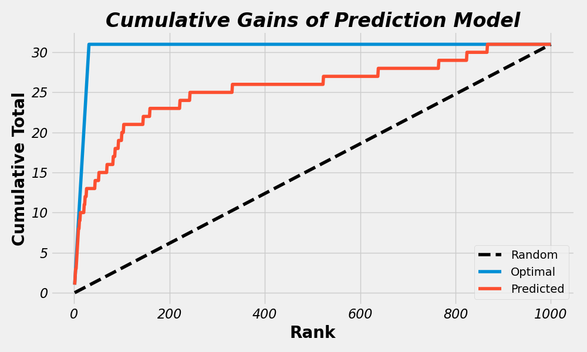

# DS-Helpers

This is a library that contains some helper functions and classes to make it easier to visualize data and build machine learning pipelines.


## Local Installation

You can install the library locally with the following command:

`pip install git+https://github.com/ramalldf/ds-helpers.git`

Then verify that ds-helpers was installed with `pip freeze` 


## Examples
### Plot Cumulative Gains Curve

```
# Import data and plotting functions
from ds_helpers.io_helpers import load_classifier_predictions
from ds_helpers.dataviz_helpers import plot_cumulative_gains

# Load sample classifier data
data = load_classifier_predictions()

data.head(3)
>>> prediction  actual
0    0.007040       0
1    0.017273       0
2    0.008522       0

# Plot cumulative gains curve and print error
plot_cumulative_gains(data['actual'], data['prediction'])
>>>Error rate (1 - (AUC pred / AUC optimal)):  0.163

```



